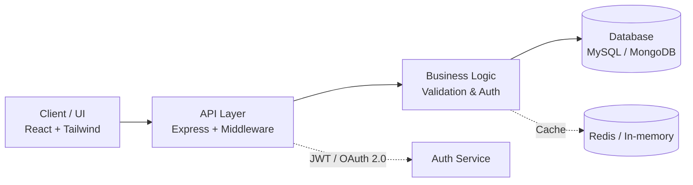
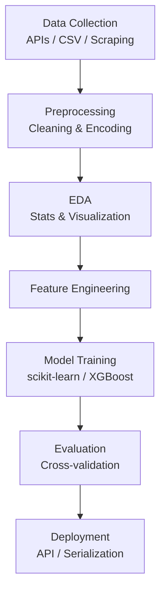
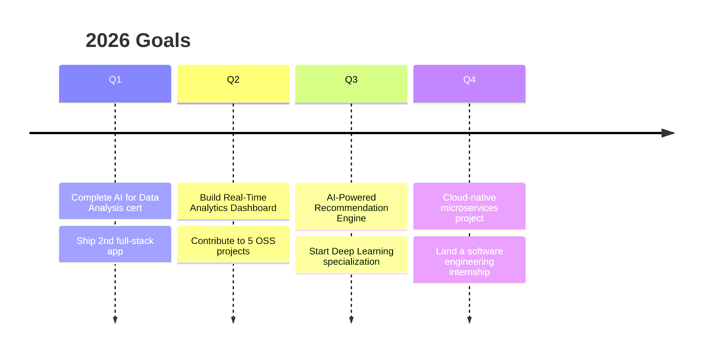

<div align="center">


<br>


</div>

<br>

## Table of Contents

<table>
<tr>
<td valign="top" width="33%">

**Profile**
- [Overview](#overview)
- [Education](#education)
- [Certifications](#certifications)

</td>
<td valign="top" width="33%">

**Work**
- [Tech Stack](#tech-stack)
- [Featured Projects](#featured-projects)
- [AI/ML Pipeline](#aiml-pipeline)
- [Architecture Principles](#architecture--system-design)

</td>
<td valign="top" width="33%">

**More**
- [GitHub Stats](#github-stats)
- [Roadmap 2026](#roadmap-2026)
- [Security Practices](#security-practices)
- [Contact](#lets-connect)

</td>
</tr>
</table>

---

## Overview

> 🌸 Hey, I'm Kamran — a full-stack developer and AI/ML enthusiast who loves turning ideas into working software. Backed by a Computer Science degree and five Google Career Certificates, I enjoy building things end-to-end and learning something new every day.

| | |
|---|---|
| 🎓 **Education** | BS Computer Science — Sukkur IBA University (2027) |
| 🧰 **Core Stack** | JavaScript, Python, Java, React, Node.js, MySQL, MongoDB |
| 🎯 **Focus Areas** | Full-Stack Development · AI/ML · Cloud Fundamentals |
| 💼 **Open To** | Software engineering internships, freelance work, collaboration |
| 📍 **Location** | Pakistan |

<details>
<summary>🍃 <b>A few fun facts about me</b></summary>
<br>

- ☕ Code fuels better with a cup of chai nearby
- 🌙 Most productive after midnight
- 📚 Always mid-way through a new course or certification
- 🤝 Genuinely enjoys helping other devs debug their code
- 🚀 Believes the best projects start as messy side experiments

</details>

---

## Education

**Bachelor of Science, Computer Science** — Sukkur IBA University · *Expected May 2027*

<details>
<summary><b>Core coursework</b></summary>
<br>

- Data Structures & Algorithms
- Object-Oriented Programming
- Database Management Systems
- Web Development & Full-Stack Architecture
- Artificial Intelligence Fundamentals
- Discrete Mathematics & Computational Theory
- Software Engineering Practices
- Computer Networks & Protocols

</details>

## Certifications

| Certification | Issuer | Completed | Status |
|---|---|---|---|
| AI for Data Analysis | Google Career Certificates | June 2026 | 🟡 In Progress |
| Foundations of Data Science | Google Career Certificates | Dec 2025 | ✅ Completed |
| Get Started with Python | Google Career Certificates | Dec 2025 | ✅ Completed |
| Play It Safe: Manage Security Risks | Google Career Certificates | Sep 2025 | ✅ Completed |
| Foundations of Cybersecurity | Google Career Certificates | Aug 2025 | ✅ Completed |

> 📌 `TODO`: add verification links for each certificate.

---

## Tech Stack

<div align="center">


</div>

<details>
<summary><b>Proficiency breakdown by domain</b></summary>
<br>

| Domain | Technologies |
|---|---|
| **Languages** | Python (primary — data/ML/backend), JavaScript ES6+ (frontend/full-stack), Java (desktop/GUI), C/C++ (algorithms, fundamentals) |
| **Frontend** | React (hooks, Context/Redux), HTML5/CSS3, Tailwind CSS, responsive & accessible UI |
| **Backend** | Node.js/Express, REST API design, JWT/OAuth 2.0, middleware architecture |
| **Databases** | MySQL, MongoDB, PostgreSQL, Firebase — schema design, indexing, query optimization |
| **AI/ML** | Pandas, NumPy, scikit-learn, XGBoost, Matplotlib/Seaborn, TensorFlow/Keras (learning) |
| **Cloud/DevOps** | AWS (EC2, S3, Lambda), Docker fundamentals, GitHub Actions, Vercel/Heroku deployment |

</details>

---

## Architecture & System Design



**Principles applied:** separation of concerns · RESTful API design · role-based access control · input validation at every boundary · horizontal scalability where applicable.

---

## Featured Projects

### 🎓 Freelancer Hiring Platform
Desktop application for managing freelancer–client relationships, payments, and performance tracking.

`Python` `Tkinter` `MySQL` `MVC Architecture`

- Dual role-based access (Admin / Client / Freelancer)
- Payment tracking, invoicing, and ratings system
- 3NF-normalized schema with full CRUD operations

**[View Repository →](#)**

---

### 🌦️ Weather Application
Real-time weather app with forecasting and multi-city tracking.

`Java` `OpenWeatherMap API` `Swing/JavaFX`

- 7-day forecasting and unit conversion
- Location-based auto-detection
- JSON persistence for search history

**[View Repository →](#)**

---

### 🌐 Personal Portfolio
Production React site showcasing projects, certifications, and contact channels.

`React 18` `Tailwind CSS` `Vercel`

- Lighthouse score 90+, mobile-first, SEO-optimized
- Dark/light theme toggle, accessible components

**[Live Site → kamrandev.me](https://kamrandev.me)**

---

### 🤖 AI/ML Project Portfolio
Ongoing collection of applied data science projects.

<details>
<summary><b>See sub-projects</b></summary>
<br>

| Project | Stack | Focus |
|---|---|---|
| Predictive Analytics Dashboard | Pandas, scikit-learn, Matplotlib | Regression models, evaluation, visualization |
| Exploratory Data Analysis | Jupyter, Seaborn, NumPy | Statistical analysis, correlation discovery |
| Classification Project | scikit-learn, XGBoost | Feature engineering, hyperparameter tuning |
| NLP Basics | NLTK, spaCy | Sentiment analysis, text classification |

</details>

**[View Repository →](#)**

---

## AI/ML Pipeline



---

## GitHub Stats

<div align="center">


</div>

---

<details>
<summary><b>⚙️ One-time setup: enable the 3D contribution graph & snake animation</b></summary>
<br>

**1. 3D Contribution Graph** — create `.github/workflows/profile-3d-contrib.yml` in this repo:

```yaml
name: 3D Profile Contribution Graph

on:
  schedule:
    - cron: "0 0 * * *"   # daily at midnight UTC
  workflow_dispatch:

jobs:
  build:
    runs-on: ubuntu-latest
    permissions:
      contents: write
    steps:
      - uses: actions/checkout@v4
      - uses: yoshi389111/github-profile-3d-contrib@0.7.1
        env:
          GITHUB_TOKEN: ${{ secrets.GITHUB_TOKEN }}
          USERNAME: kamran-nizamani
      - name: Commit generated SVGs
        run: |
          git config user.name github-actions
          git config user.email github-actions@github.com
          git add -f ./profile-3d-contrib/*.svg
          git commit -m "Update 3D contribution graph" || exit 0
          git push
```

Available themes include `night-view` (used above, blue-toned). Full theme list is in the [action's README](https://github.com/yoshi389111/github-profile-3d-contrib).

**2. Contribution Snake** — create `.github/workflows/snake.yml`:

```yaml
name: Snake Animation

on:
  schedule:
    - cron: "0 0 * * *"
  workflow_dispatch:

jobs:
  generate:
    runs-on: ubuntu-latest
    permissions:
      contents: write
    steps:
      - uses: Platane/snk@v3
        with:
          github_user_name: kamran-nizamani
          outputs: |
            dist/github-contribution-grid-snake-dark-blue.svg?palette=github-dark-blue
      - uses: crazy-max/ghaction-github-pages@v4
        with:
          target_branch: output
          build_dir: dist
        env:
          GITHUB_TOKEN: ${{ secrets.GITHUB_TOKEN }}
```

Both workflows need a **separate public repo named exactly `kamran-nizamani`** (matching the username) — that's the special repo GitHub renders as your profile README.

</details>

---

<details>
<summary><b>What I apply in every project</b></summary>
<br>

- Input validation & sanitization, SQLi/XSS/CSRF prevention
- Password hashing with bcrypt/argon2
- JWT & OAuth 2.0 authentication, role-based access control
- HTTPS/TLS, environment-based secrets management
- Awareness of OWASP Top 10 and dependency scanning

**Related certifications:** Foundations of Cybersecurity, Play It Safe: Manage Security Risks (Google)

</details>

---

## Roadmap 2026



| Goal | Target | Status |
|---|---|---|
| Full-stack applications shipped | 2 | 🟡 1/2 |
| Open-source contributions | 5 projects | 🟡 3/5 |
| GitHub contributions | 500 | 🟡 375/500 |
| AWS Cloud Practitioner | Certified | ⚪ Planned |

---

## Let's Connect

<div align="center">

[](https://kamrandev.me)
[](https://www.linkedin.com/in/kamran-khan22)
[](https://github.com/kamran-nizamani)
[](mailto:kamrannizamani35@gmail.com)

</div>

**Looking for:** software engineering internships (Summer 2026) · freelance full-stack/AI work · open-source collaboration · mentorship.

<div align="center">


💌 *Thanks for stopping by! If any of this made you smile, feel free to say hi — always happy to build something nice together.*

[⬆ Back to top](#table-of-contents)

</div>
